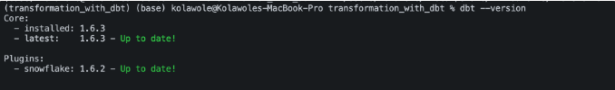
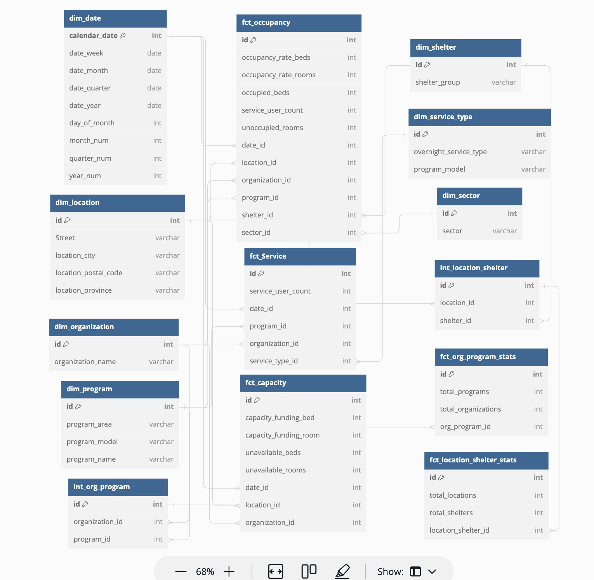

Welcome to your new dbt project!

### Using the starter project

Try running the following commands:
- dbt run
- dbt test


### Resources:
- Learn more about dbt [in the docs](https://docs.getdbt.com/docs/introduction)
- Check out [Discourse](https://discourse.getdbt.com/) for commonly asked questions and answers
- Join the [chat](https://community.getdbt.com/) on Slack for live discussions and support
- Find [dbt events](https://events.getdbt.com) near you
- Check out [the blog](https://blog.getdbt.com/) for the latest news on dbt's development and best practices


## CREATING A `dbt` PROJECT

1. Create an empty Github repo
2. `dbt init project_name` in the repo
    1. Don’t configure the repo here. This would allow dbt create a blank/empty repository
3. cd into the repository root folder `cd transformation_with_dbt`

The purpose is to run all operation from a virtual env

1. Run `touch Pipfile`
2. Open the pipfile created and paste this:
    
    ```toml
    [[source]]
    url = "https://pypi.org/simple"
    verify_ssl = true
    name = "pypi"
    
    [packages]
    dbt-core = "==1.6.3"
    dbt-snowflake = "==1.6.2"
    sqlfluff = "==2.3.2"
    sqlfluff-templater-dbt = "==2.3.2"
    pre-commit = "==3.4.0"
    
    [requires]
    python_version = "3.11"
    ```
    
3. Run `pip install pipenv`
4. Run `pipenv install`
5. Active virtual envr. Run `pipenv shell`
6. Confirm if dbt has been successfully installed
    
    Run `dbt --version`
    
    You should have something as this
    
    

    ERD for warehouse deveopment - Toronto Shelter Occupancy
    

## For Best-Practice - Configure `SQLfluff` before building.
 - In you project root directory, add files
     - [.sqlfluff](.sqlfluff), and 
     - [.sqlfluffignore](.sqlfluffignore).